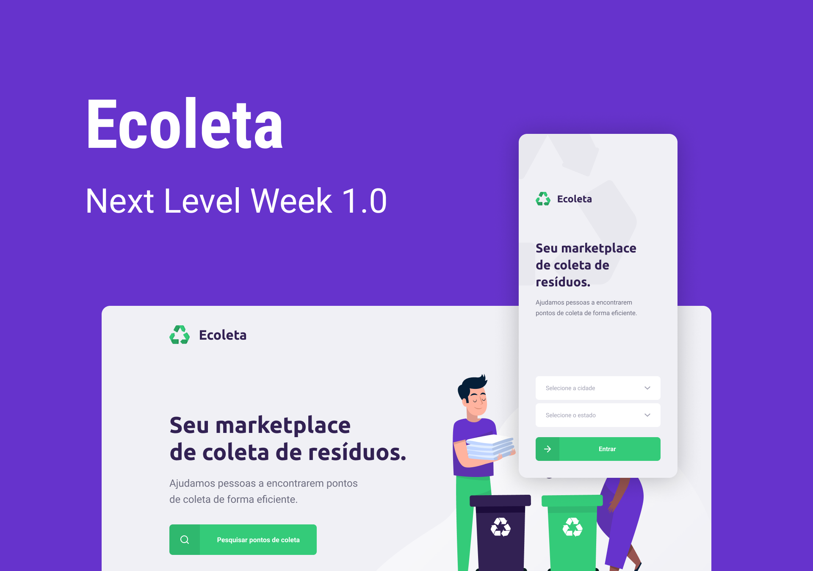

# Next Level Week - Ecoleta ( Marketplace de reciclagem / Recycling marketplace )

 Ecoleta é um marketplace que ajuda pessoas a encontrar pontos de coleta de resíduos de forma eficiente.
----------------------------------------------------------------------------------------------------------
 Ecoleta is an marketplace that helps people to find waste collection points efficiently.

⚙️ **Tecnologias utilizadas / Used Technologies**
 
- [Express](https://expressjs.com/)
- [React Leaflet](https://react-leaflet.js.org/)
- [Axios](https://axios-http.com/)
- [Expo](https://expo.dev/)
- [Node.js](https://nodejs.org/en/)
- [Sqlite3](https://sqlite.org/index.html)
- [Typescript](https://www.typescriptlang.org/)
- [ReactJS](https://reactjs.org/)
- [React Native](https://reactnative.dev/)

----------------------------------------------------------------------------------------------------------

🚀 **Como rodar o projeto / Running the project**

Rode o servidor na pasta ( Run the server on the folder ) `/server` com ( with ) `npm dev`

Rode o front-end na pasta ( Run the frontend on the folder ) `/web` com ( with ) `npm start`

Rode o mobile na pasta ( Run the mobile on the folder ) `mobile` com ( with ) Expo `expo start`

----------------------------------------------------------------------------------------------------------

🧑🏾‍💻 **Autor / Author**

**Matheus Gomes de Souza**

LinkedIn: https://www.linkedin.com/in/matheus-gomes-de-souza/  
E-mail: matheusg_souza@outlook.com
